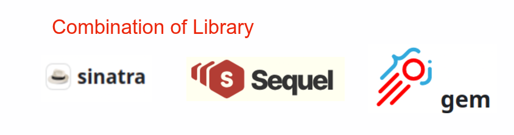
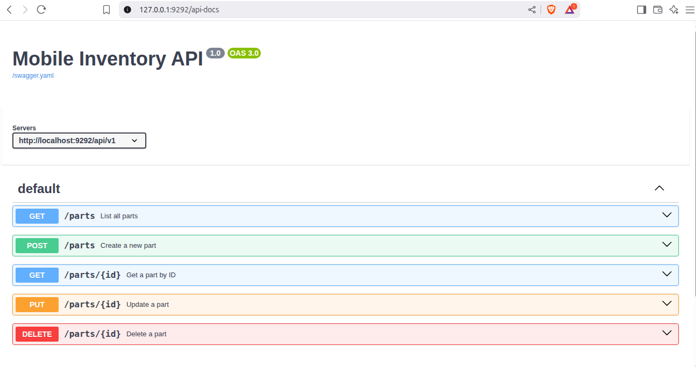

## Introduction

This Appliction is just Sample of How Ruby Sinatra Framwork can you for REST Application Develoment. Using  bare minimu libray using get it Down Requirment 
It is use full for Microservice Application 
Indivisualt  Module API has own Data base It's Indepnedent 





## This Demo App is Uses Ruby Libray gem 

- Sinatra
- sequel 
- sqlite3
- oj
- puma
- jwt
- bcrypt
- rack

## Description:

### Sinatra Gem:
Sinatra is a DSL for quickly creating web applications in Ruby with minimal effort to develop web Application and REST API


### sequel Gem:
Database Toolkit for Ruby Interation to Database

- It's Thread safety, connection pooling and a concise DSL for constructing SQL queries and table schemas.
- Comprehensive ORM layer for mapping records to Ruby objects and handling associated records.
- Advanced database features such as prepared statements, bound variables, stored procedures, savepoints, two-phase commit, transaction isolation, primary/replica configurations, and database sharding.
- Verity of Database connection adapters for ADO, Amalgalite, IBM_DB, JDBC, MySQL, Mysql2, ODBC, Oracle, PostgreSQL, SQLAnywhere, SQLite3, TinyTDS, and Trilogy.


### oj Gem:
 A fast JSON parser and Object marshaller as a Ruby gem. 
 This isue for Ruby object Serialise to JSON 


### Run Appliation

Clone project form git repository from [git@github.com:surendra83/inventory.git](https://github.com/surendra83/inventory)

```Ruby
cd inventory

$inventory> bundle install

$inventory> rackup

```
## Test in Browser
http://localhost:9292/api-docs



## view the product list
http://localhost:9292/view/part 

